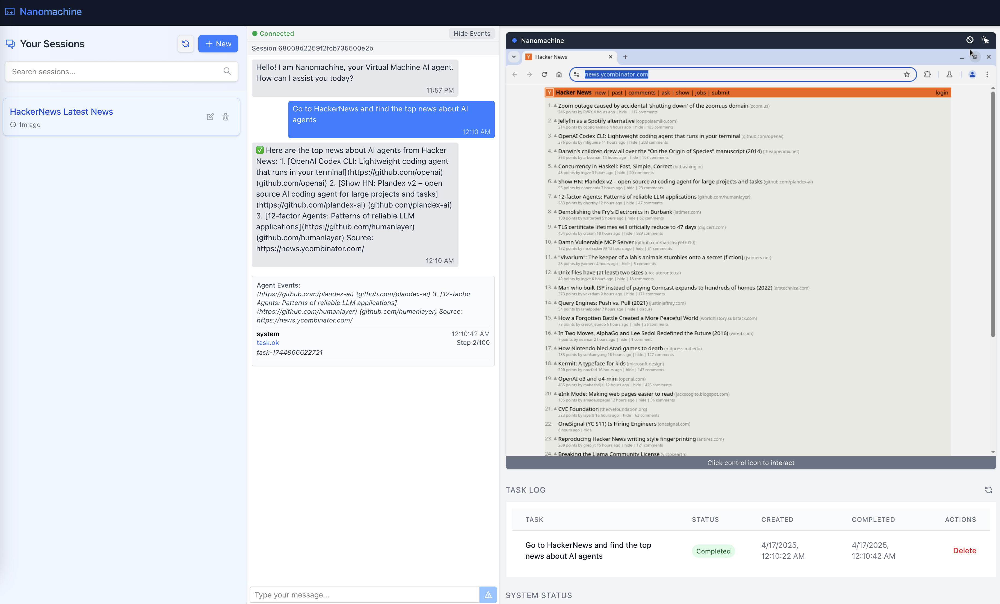

# Nanomachine



Nanomachine is a Virtual Machine (VM) AI agent dashboard that enables intelligent operative system automation and control. It provides a modern, intuitive interface for interacting with AI agents that can navigate and perform tasks in web browsers, filesystems, and more.

**Join Our Community!**

[](https://discord.gg/mncgG7JHfS)


## Project Overview

Nanomachine consists of three main components that work together to provide a seamless AI agent experience:

1. **Client**: React-based web application that serves as the user interface
2. **Server**: Node.js backend that manages tasks, chats, and system state
3. **Bridge**: Communication layer between the server and Nanobrowser extension
4. **Docker Container**: Docker container that provides an isolated environment for running the Nanobrowser extension (contains the browser and VNC server)

## Architecture

```
┌─────────────┐                  ┌─────────────┐                  ┌─────────────┐
│             │                  │             │                  │             │
│   Client    │ ◄──────────────► │   Server    │ ◄──────────────► │   Bridge    │
│  (React)    │   WebSocket/HTTP │  (Node.js)  │   WebSocket/HTTP │  Service    │
│             │                  │             │                  │             │
└─────────────┘                  └─────────────┘                  └─────────────┘
                                                                         ▲
                                                                         │
                                                                         ▼
                                                              ┌───────────────────┐
                                                              │  Docker Container │
                                                              │   (Debian Linux)  │
                                                              │  ┌─────────────┐  │
                                                              │  │             │  │
                                                              │  │ Nanobrowser │  │
                                                              │  │ Extension   │  │
                                                              │  │             │  │
                                                              │  └─────────────┘  │
                                                              └───────────────────┘
```

## Compatibility

Nanomachine currently runs on Linux and macOS (Intel & Apple Silicon). Windows support is coming soon.

## Components

### Client

The client application provides the user interface for interacting with AI agents:

- **Chat Interface**: Communicate with AI agents through a familiar chat interface
- **Task Log**: Monitor AI agent tasks with live status updates and progress indicators
- **VM Canvas**: View and control browser sessions through an embedded VNC interface
- **System Status**: Track the status of all system components

[Learn more about the client component](./client/README.md)

### Server

The server handles the business logic and data persistence:

- **HTTP API**: RESTful endpoints for chat and task management
- **WebSocket Server**: Real-time communication using Socket.IO
- **Database Integration**: MongoDB for data persistence
- **Bridge Communication**: Integration with the bridge service
- **VNC Service**: Proxy for remote browser control

[Learn more about the server component](./server/README.md)

### Bridge

The bridge facilitates communication between the Nanomachine application and the Nanobrowser extension:

- **WebSocket Server**: Handles real-time bidirectional communication
- **HTTP REST API**: Provides endpoints for configuration and task management
- **Task Routing**: Manages task creation, tracking, and event processing
- **Configuration API**: Endpoints for LLM provider and agent model configuration

NOTE: The bridge is installed inside the Docker container automatically.

[Learn more about the bridge component](./bridge/README.md)

### Scripts

The scripts directory contains utility scripts for managing the Nanomachine environment:

- **Installation Scripts**: Set up the environment and its components
- **Runtime Scripts**: Start, stop, and restart services
- **Utility Scripts**: Perform system checks and maintenance tasks

[Learn more about the scripts](./scripts/README.md)

### Docker Container

The Docker container provides an isolated environment for running the Nanobrowser extension:

- **Chromium Browser**: Pre-configured web browser with the Nanobrowser extension
- **VNC Server**: Allows remote viewing and control of the browser
- **noVNC**: Web-based VNC client for browser access

The container is based on a minimal Debian Linux image optimized for browser automation.

### Nanobrowser

[Nanobrowser](https://github.com/nanobrowser) is a browser automation Chrome extension that allows you to control your browser, it's based on [Browser Use](https://github.com/browser-use)

Nanomachine interacts with it using a [forked version of it](https://github.com/reindent/nanobrowser) that exposes endpoints to operate and configure it.

The original project is available at [nanobrowser/nanobrowser](https://github.com/nanobrowser/nanobrowser).

## Getting Started

### Prerequisites

- Node.js 18+
- MongoDB 4.4+
- Docker (for running the Nanobrowser container)

### Installation

1. Clone the repository:

   ```bash
   git clone https://github.com/reindent/nanomachine.git
   cd nanomachine
   ```
2. Install dependencies for all components:

   ```bash
   npm run install:all
   ```
3. Configure environment variables:

   - Copy `.env.template` to `.env` in server and client directories
   - Update the values as needed for your environment
4. Start all components:

   ```bash
   npm run dev
   ```
5. Navigate to http://localhost:5173

## Configuration

Each component can be configured through environment variables. See the individual component README files for detailed configuration options.

## Roadmap

- [X] Dashboard
- [X] Docker container
- [X] VNC client
- [X] Install scripts
- [X] Browsing AI agent integration (using Nanobrowser)
- [ ] Tests: we need to add tests for all components
- [ ] Multiple browser sessions: ideally each session has its own VM
- [ ] VM AI agent: operate virtual machines, OS, filesystem, etc. using natural language
- [ ] Windows support: add scripts for Windows
- [ ] Electron app: add a desktop application for a more native experience
- [ ] Mobile app: create a mobile application to monitor and control the AI agents
- [ ] More to come...

## Contributing

We welcome contributions to Nanomachine! Please see our [Contributing Guide](./CONTRIBUTING.md) for more information on how to get started.

## License

This project is licensed under the [MIT License](./LICENSE.md) unless otherwise specified. Some components may have different licensing terms.

© 2025-present Reindent LLC <contact@reindent.com>
